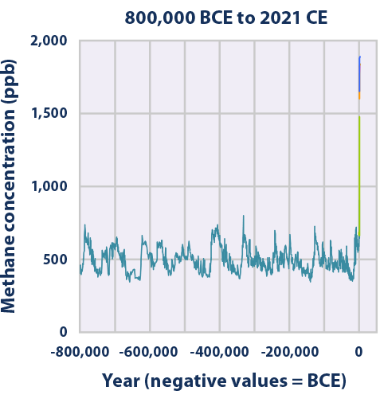

# GasFlux: Algorithms for deriving gas emissions flux from mobile atmospheric measurements 

GasFlux is a tool for processing atmospheric gas concentration data and windspeeds into mass emissions fluxes, with principle applications to greenhouse gas measurement and vulcanology. Currently it works with in situ ("sniffing") data from UAVs and other aircraft, using mass balance as a paradigm and kriging as an interpolation strategy, but the intention is to expand this to other kinds of sampling and processing strategies, such as open-path and tracer methods.

|  |
|:--:| 
| *[source](https://www.epa.gov/climate-indicators/climate-change-indicators-atmospheric-concentrations-greenhouse-gases#)* |

    "If you can't measure it, you can't manage it.”

## Purpose
The project has two aims:
1. Provide software to produce emissions fluxes from input data in a way that is accessible, reproducible, transparent and allows for quantification of uncertainty 
2. Provide a clearinghouse website for best practice in the main techniques for measuring gas fluxes in the open atmosphere

The primary focus is on site-level quantification of greenhouse gas emissions (especially methane) from concentrated industry such as oil and gas, landfills and intensive agriculture, taken from mobile concentration measurements.

The basic methodologies are applicable to many diverse situations where gas emissions are being quantified in the open atmosphere, such as volcanic emissions, or non-greenhouse gas emissions from industry. Methods for more diffuse emissions such as those from ecosystems and extensive agriculture will be developed as the project matures.

## Background

The project has its roots in the mass-balance method developed by [Grant Allen]'s group at Manchester University for use on drone and manned aircraft platforms since 2012. Development of the package is currently co-ordinated by [Jamie McQuilkin].

## Beta

A beta version of the project is available to those doing measurements or who want to help with coding at [github.com/gasflux/gasflux](https://github.com/gasflux/gasflux). An example of data visualisations from the package can be found [here](docs/testdata_ch4_report.html).

[Grant Allen]: https://research.manchester.ac.uk/en/persons/grant.allen
[Jamie McQuilkin]: https://github.com/pipari

|  |
|:--:|
| *Drone and weather mast* |